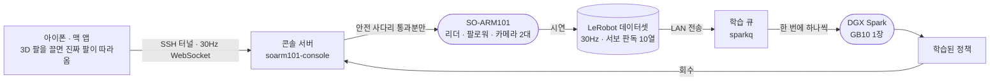
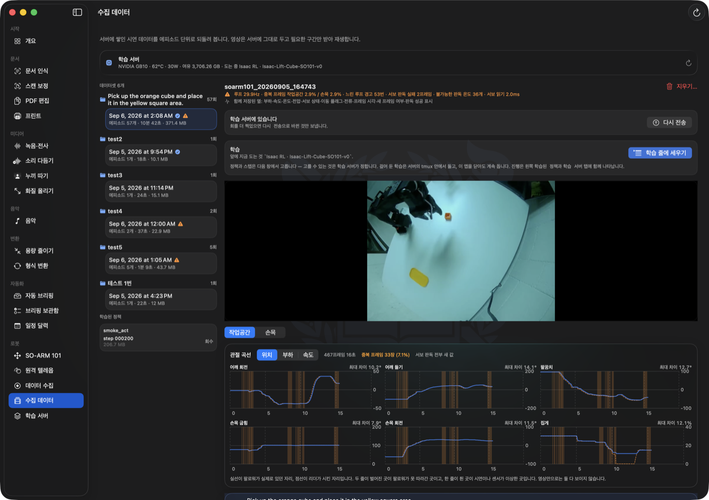
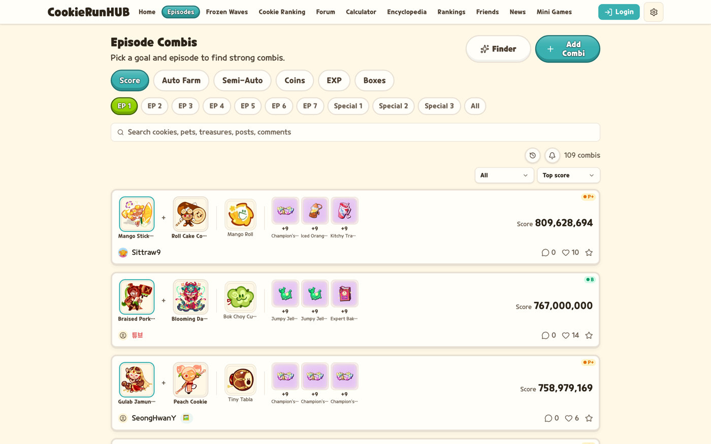

## 박세환 · Sehwan Park

서울대학교 자유전공학부 25학번 · 전기정보공학부 전공 · 휴머노이드 로봇 팀 [SHAPE](https://github.com/snu-shape)

로봇 원격조작으로 사람의 시연을 모으고 그 데이터로 정책을 학습시키는 파이프라인을 만들어 옴.
팔과 카메라를 쥔 콘솔 서버, GPU 하나 앞의 학습 큐, 그 둘을 원격으로 조작하는 맥 앱까지 층별로
직접 만들어 하나로 이었음. 웹 쪽에서는 월 활성 사용자 14만 명이 쓰는 서비스를 자택 리눅스
서버에서 6개월째 혼자 운영 중임. 어느 쪽이든 데모가 아니라 **실제로 돌아가는 상태까지** 만들고
유지하는 일을 함.

<table>
<tr>
<td width="50%"></td>
<td width="50%"></td>
</tr>
<tr>
<td width="50%" align="center">찍은 시연을 되돌려 보는 화면 — 리더가 시킨 자리(점선)와 팔로워가 실제로 있던 자리(실선)</td>
<td width="50%" align="center">혼자 만들어 운영 중인 게임 정보 서비스 — 월 활성 14만 명</td>
</tr>
</table>

---

### 로보틱스 · Physical AI

**[soarm101-console](https://github.com/sesepark/soarm101-console)** — SO-ARM101 운영 콘솔과 원격 텔레옵 (64커밋)  
팔과 카메라를 쥔 서버 쪽 전부. 물리 리더 없이 3D로 그린 팔을 끌어 조작하는 **가상 리더**를 만들어,
맥과 아이폰에서 같은 화면으로 팔을 움직이게 함. 목표값은 서버의 안전 사다리(관절 한계 · 틱당
변화량 · 부하 · 전류 · 추종오차 · 온도 · 워치독)를 통과해야 모터에 닿고, 조작 권한은 한 시점에
한 기기만 가짐. 수집 데이터에는 위치 말고도 서보가 내주는 값 전부를 **원본 그대로** 별도 열로
남김 — 나중에 모터 부하로 간접 촉각을 추정하려는 것이고, 시연은 다시 찍을 수 없기 때문임.

**[xarm7-pi0-teleop](https://github.com/sesepark/xarm7-pi0-teleop)** — xArm7 텔레오퍼레이션 · pi0 데이터 수집 워크스페이스  
GELLO 리더암과 스마트폰(WebXR)으로 xArm7을 조작하고, 시연을 LeRobot 데이터셋으로 기록해
pi0(OpenPI) 정책을 학습·재생함. 리더암 엔코더의 초기 offset 오차가 FK 비선형성을 타고 endpoint
오차로 새는 문제를, 절대 관절값 대신 팔로워 기준 관절에 리더 delta를 더한 "가상 관절"로 해결함.
제어 루프(30Hz)가 네트워크 왕복 없이 돌도록 xArm7 순기구학을 직접 구현함.
→ 텔레옵 구현은 [lerobot_robot_ufactory 기여분](https://github.com/sesepark/lerobot_robot_ufactory/tree/xarm7-gello-webxr) (upstream 대비 16파일 / 1,893줄)

**[sparkq](https://github.com/sesepark/sparkq)** — DGX Spark의 GPU 하나 앞에 학습을 줄 세우는 작업 큐  
희소 자원이 GB10 한 장이라 슬롯은 하나임. 통합메모리라 두 학습이 겹치면 OOM으로 깨지는 대신
**둘 다 스왑으로 느려지는** 방식으로 망가지는데, 그쪽이 훨씬 알아채기 어려움. 그래서 앞 작업이
끝났는지가 아니라 `nvidia-smi`에 컴퓨트 프로세스가 하나도 없는지를 보고 다음을 꺼냄. 표준
라이브러리만 쓰고 상태는 전부 파일임.

**[ai-worker-humanoid-challenge](https://github.com/sesepark/ai-worker-humanoid-challenge)** — 휴머노이드 챌린지 Mission A (팀 프로젝트)  
ROBOTIS AI Worker 기반 팀 프로젝트에서 **텔레오퍼레이션 오퍼레이터 스테이션**을 담당함
(전체 90커밋 중 70커밋). 영상 패널을 RViz 밖으로 분리해 X11에서 죽던 문제를 없애고, 손목
RealSense의 USB 대역 포화를 잡고, ZED 뎁스 어시스트 오버레이와 주행 패널·cmd_vel mux를 구성함.

---

### 시스템 · 서비스 개발

**[cookierunhub-docs](https://github.com/sesepark/cookierunhub-docs)** — 게임 정보 서비스 (단독 개발·운영)  
6개월간 혼자 설계·개발·운영 중인 3개국어 웹서비스의 엔지니어링 기록. **월 활성 사용자 14만 명**,
728커밋 / 약 21.8만 줄 / DB 마이그레이션 156개. 관리형 플랫폼이 아니라 자택 리눅스 서버에서
돌리기 때문에 **blue-green 무중단 배포와 10초 주기 health 기반 자동 장애 복구를 직접 구현**함.
사용자 게시글까지 번역해야 해서 로케일 파일이 아니라 DB 스키마와 번역 워커로 파이프라인을
구성했고, 실제 상위 유입 지역이 전부 태국인 것으로 그 판단이 값을 함. (코드와 수집 데이터는
비공개, 구조와 판단 근거만 공개)

**[seoul-local-agent](https://github.com/sesepark/seoul-local-agent)** — Apple Silicon 온디바이스 개인 에이전트  
전부 기기 안에서 도는 Swift 메뉴바 앱(5.3만 줄 · 테스트 480개). 메일·메시지·학교 공지를 **읽기
전용**으로 모아 브리핑하고, 음성 전사·문서 인식·미디어 처리를 로컬 모델로 처리함. 위 로봇
파이프라인 전체를 조작하는 원격 콘솔이기도 함. 보안 경계를 관례가 아니라 코드로 강제한 점
(전송·수정·삭제 API를 **아예 구현하지 않음**, 메시지 본문을 지시로 해석하지 않음, 쓰기 대상
페이지 재검증)에 가장 공을 들임.

**[shape-new-web](https://github.com/sesepark/shape-new-web)** — SHAPE 공개 웹사이트이자 내부 운영 시스템  
소개 페이지가 아니라 장비 예약·자격 검증·권한 위임·웹 푸시까지 동아리 운영이 실제로 돌아가는
자리를 웹으로 옮긴 것. 프런트·백엔드·스키마·배포를 단독 개발함. 가장 많은 고민이 들어간 부분은
**전부 무료 티어 위에서 돌아가게 만드는 것**이었고, Neon 요금이 질의 횟수가 아니라 *깨어 있는
시간*이라 2단 캐시의 창 길이를 맞추는 식으로 풀었음. → [www.snu-shape.com](https://www.snu-shape.com)

**[shamoa-snu-programs](https://github.com/sesepark/shamoa-snu-programs)** — 서울대 해외 프로그램 탐색·추천 앱 (수업 최종 프로젝트)  

---

### 오픈소스 기여

**[headroom](https://github.com/headroomlabs-ai/headroom)** — AI 에이전트용 컨텍스트 압축 레이어 (라이브러리 · 프록시 · MCP)  
[PR #3331](https://github.com/headroomlabs-ai/headroom/pull/3331) — 메인테이너 승인, 머지 대기
터미널을 닫으면 SIGTERM이 아니라 **SIGHUP**이 오는데, `claude` 경로만 이 신호를 처리하고
나머지 도구(codex, aider, cursor 등)가 공유하는 두 경로는 처리하지 않았음. 그래서 래퍼가
`finally: cleanup()`을 실행하지 못한 채 죽고, 프록시가 PID 1로 재부모화되어 포트를 붙든 채
남았음. 코드를 읽다 찾은 게 아니라 **8일 19시간째 살아 있던 유출 프록시**에서 출발했고, 소스
문자열 매칭이 아니라 실제 자식 프로세스를 SIGHUP으로 종료시켜 누수를 재현하는 테스트를 함께 넣음.

---

### 주로 쓰는 것

로봇 · ROS 2 / MoveIt / RealSense · ZED / LeRobot / OpenPI(pi0) / Isaac Lab / xArm SDK / Feetech SDK
학습 · PyTorch / MLX / LoRA 파인튜닝
백엔드 · Python · FastAPI · SQLAlchemy · PostgreSQL · Alembic
프론트 · TypeScript · Next.js · React · three.js
인프라 · Docker · Caddy · systemd · GitHub Actions · 자체 리눅스 서버 운영
그 외 · Swift · Kotlin

---

📮 park7132872@snu.ac.kr
